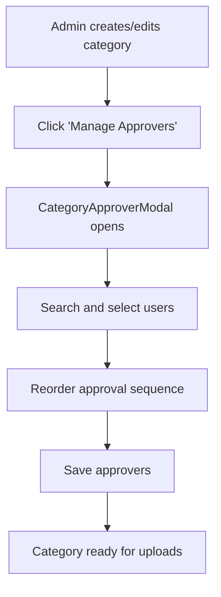
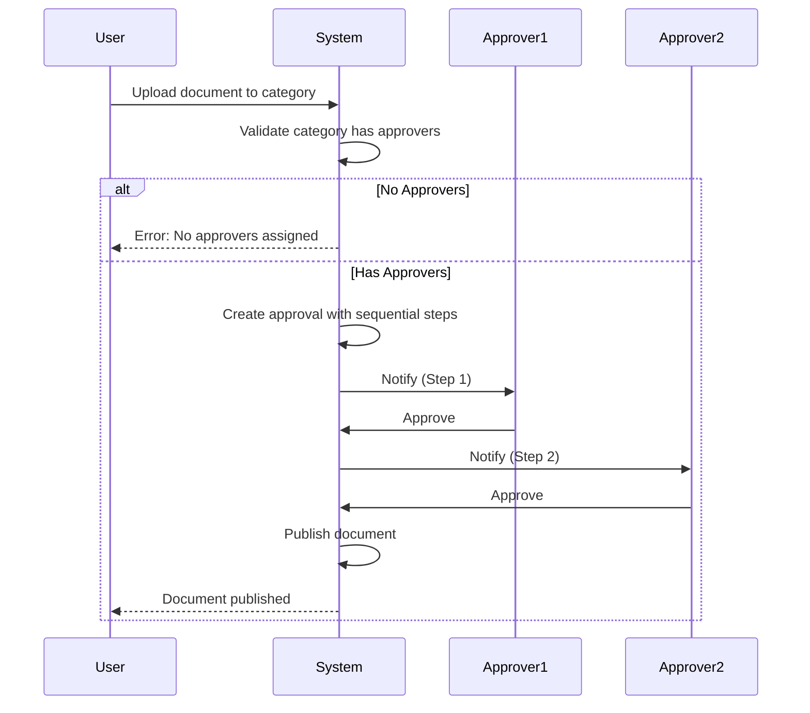

# Document Vault Category Approvers - Implementation Summary

**Date**: 2026-01-16  
**Feature**: Approval People Selection for Document Vault Categories

## Overview

This feature adds the ability to assign specific users as approvers to document vault categories. When documents are uploaded to categories with assigned approvers, they automatically trigger sequential approval workflows where each approver must approve in order before the document is published.

## Key Requirements Implemented

✅ **Approver Assignment**: Specific users can be assigned to each category  
✅ **Sequential Approval Flow**: All assigned approvers must approve in order (Step 1, Step 2, etc.)  
✅ **Mandatory Approval**: Always required for categories with approvers  
✅ **Upload Validation**: Blocks uploads to categories without approvers

## Database Changes

### New Table: CategoryApprover

```sql
CREATE TABLE [dbo].[CategoryApprover] (
    [id] INT PRIMARY KEY IDENTITY(1,1),
    [categoryId] INT NOT NULL,
    [userId] NVARCHAR(450) NOT NULL,
    [stepOrder] INT NOT NULL DEFAULT 1,
    [createdAt] DATETIME2 NOT NULL DEFAULT CURRENT_TIMESTAMP,
    [createdBy] NVARCHAR(450) NOT NULL,
    -- Foreign keys to VaultDocumentCategory and User
);
```

**Migration File**: `prisma/migrations/20260116_add_category_approvers/migration.sql`

### Schema Updates

- Updated `VaultDocumentCategory` model to include `CategoryApprover` relation
- Updated `User` model to include CategoryApprover relations
- Added indexes for performance optimization

## API Endpoints

### New Endpoints

1. **GET/POST /api/admin/document-vault/categories/[id]/approvers**
   - Get list of approvers for a category
   - Assign/replace approvers for a category
   - Delete all approvers from a category

2. **GET /api/admin/users/search**
   - Search users by name or email for approver assignment

### Updated Endpoints

1. **GET /api/admin/document-vault/categories**
   - Now includes `approverCount` and `approvers` array in response

2. **GET /api/admin/document-vault/categories/[id]**
   - New endpoint to get single category with approver details

3. **POST /api/admin/document-vault** & **POST /api/document-vault/admin**
   - Added validation to block uploads to categories without approvers
   - Updated approval creation to use category approvers for sequential workflow

## UI Components

### New Components

1. **CategoryApproverModal** (`src/components/features/document-vault/CategoryApproverModal.tsx`)
   - Modal for managing category approvers
   - User search functionality
   - Drag-to-reorder approval sequence
   - Visual step indicators (Step 1, Step 2, etc.)

### Updated Components

1. **CategoryFormModal**
   - Added "Manage Approvers" section in edit mode
   - Shows approver count and warning if no approvers assigned

2. **CategoriesPageClient**
   - Shows approver count for each category
   - Added "Manage Approvers" quick action button
   - Visual indicators for categories without approvers

3. **DocumentUploadForm**
   - Category dropdown shows approver count
   - Disabled categories without approvers
   - Warning messages for invalid selections
   - Info banner showing number of approvers

## Workflow

### Admin Workflow



### Upload & Approval Workflow



## Testing Instructions

### 1. Run Migration

```bash
# Apply Prisma migration
npx prisma migrate deploy

# Or run SQL directly
sqlcmd -S your-server -d your-database -i prisma/migrations/20260116_add_category_approvers/migration.sql
```

### 2. Verify Database

```sql
-- Check table exists
SELECT * FROM INFORMATION_SCHEMA.TABLES WHERE TABLE_NAME = 'CategoryApprover';

-- Check categories without approvers
SELECT 
  vdc.id,
  vdc.name,
  COUNT(ca.id) as approverCount
FROM VaultDocumentCategory vdc
LEFT JOIN CategoryApprover ca ON ca.categoryId = vdc.id
WHERE vdc.active = 1
GROUP BY vdc.id, vdc.name;
```

### 3. Test Approver Assignment

1. Navigate to `/dashboard/admin/document-vault/categories`
2. Click edit icon on a category
3. Click "Manage Approvers" button
4. Search for users and add at least 2 approvers
5. Reorder approvers using up/down arrows
6. Save changes
7. Verify approver count displays correctly

### 4. Test Upload Validation

1. Navigate to document upload page
2. Try to select a category with no approvers
   - Should be disabled with "(No approvers - cannot upload)" text
3. Select a category with approvers
   - Should show blue info banner with approver count
4. Complete upload
5. Verify approval is created with sequential steps

### 5. Test Approval Flow

1. Upload a document to a category with 2 approvers
2. Log in as first approver
3. Navigate to approvals page
4. Approve the document
5. Verify second approver is now notified
6. Log in as second approver
7. Approve the document
8. Verify document is published

## Validation Rules

### Category Validation
- ✅ At least 1 approver required before uploads allowed
- ✅ Maximum 10 approvers per category
- ✅ No duplicate approvers allowed
- ✅ Inactive categories cannot accept uploads

### Upload Validation
- ✅ Cannot upload to category with 0 approvers
- ✅ Cannot upload to inactive category
- ✅ Server-side validation enforced

### Approval Validation
- ✅ All approvers must approve in order
- ✅ Cannot skip steps
- ✅ Sequential workflow enforced

## Files Created/Modified

### New Files (5)
1. `prisma/migrations/20260116_add_category_approvers/migration.sql`
2. `prisma/migrations/20260116_add_category_approvers/README.md`
3. `src/app/api/admin/document-vault/categories/[id]/approvers/route.ts`
4. `src/app/api/admin/users/search/route.ts`
5. `src/components/features/document-vault/CategoryApproverModal.tsx`
6. `docs/CATEGORY_APPROVERS_IMPLEMENTATION.md` (this file)

### Modified Files (11)
1. `prisma/schema.prisma` - Added CategoryApprover model
2. `src/app/api/admin/document-vault/categories/route.ts` - Include approvers in response
3. `src/app/api/admin/document-vault/categories/[id]/route.ts` - Added GET endpoint, include approvers
4. `src/app/api/admin/document-vault/route.ts` - Validation + custom approval steps
5. `src/app/api/document-vault/admin/route.ts` - Validation + custom approval steps
6. `src/components/features/document-vault/CategoryFormModal.tsx` - Manage Approvers section
7. `src/components/features/document-vault/DocumentUploadForm.tsx` - Approver info display
8. `src/components/features/document-vault/index.ts` - Export CategoryApproverModal
9. `src/app/dashboard/admin/document-vault/categories/CategoriesPageClient.tsx` - Approver display
10. `src/lib/validation/schemas.ts` - CategoryApproversSchema
11. `src/types/documentVault.ts` - CategoryApprover types

## Post-Deployment Tasks

### ⚠️ IMPORTANT: Action Required After Deployment

1. **Assign Approvers to Active Categories**
   - All existing categories will have 0 approvers after migration
   - Document uploads will be blocked until approvers are assigned
   - Identify active categories and assign approvers immediately

2. **Communicate to Users**
   - Notify admins about new approver requirement
   - Provide training on managing approvers
   - Inform users about approval workflow

3. **Monitor for Issues**
   - Check for failed uploads due to missing approvers
   - Verify approval notifications are sent correctly
   - Monitor approval completion times

## Troubleshooting

### Issue: Cannot Upload to Category

**Symptom**: Category disabled in dropdown with "No approvers" message

**Solution**:
1. Navigate to category management
2. Edit the category
3. Click "Manage Approvers"
4. Add at least one approver

### Issue: Approval Not Created

**Symptom**: Document uploaded but no approval record

**Solution**:
1. Verify category has approvers: 
   ```sql
   SELECT * FROM CategoryApprover WHERE categoryId = <category-id>;
   ```
2. Check application logs for errors
3. Verify users exist and are active

### Issue: Approvers Not Notified

**Symptom**: Approval created but approvers don't receive notification

**Solution**:
1. Check approval steps are created correctly
2. Verify notification service is running
3. Check user email addresses are valid

## Security Considerations

- ✅ Only SYSTEM_ADMIN can manage categories and approvers
- ✅ User search restricted to admin endpoints with feature gates
- ✅ Validation enforced at API level (not just UI)
- ✅ Audit trail maintained (createdBy field)
- ✅ No SQL injection vulnerabilities (using Prisma ORM)

## Performance Notes

- Indexes created on `categoryId`, `userId`, and `stepOrder` for fast lookups
- Category approver queries use explicit selects
- User search limited to 20 results maximum
- Cache invalidation after approver changes

## Future Enhancements (Not Implemented)

- [ ] Role-based approver assignment (e.g., "Any PARTNER")
- [ ] Conditional routing based on document attributes
- [ ] Parallel approval (any one can approve)
- [ ] Approval delegation for out-of-office scenarios
- [ ] Email notification customization
- [ ] Bulk approver assignment across categories
- [ ] Approval analytics and reporting

## Support

For issues or questions:
1. Check this documentation first
2. Review migration README: `prisma/migrations/20260116_add_category_approvers/README.md`
3. Check application logs for errors
4. Contact development team if issues persist

---

**Implementation Complete**: All planned features implemented and ready for testing.
